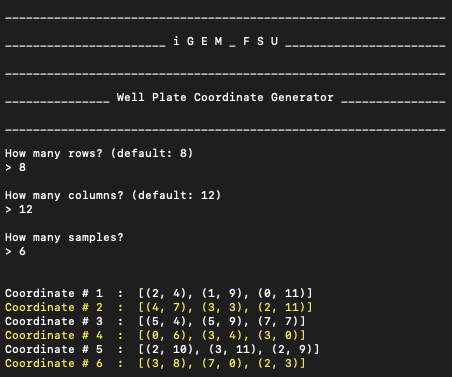

# Unique Random Coordinate Generator
First, specify `n` and `m` in an `n * m`-dimensional well plate (a 2D grid).

Second, specify how many samples you'd like to place in the plate.

*Each sample receives three sets of coordinates. This is a clinical best practice to reduce the possibility for error in an experiment.*

Screenshot of the program running in an OS X Terminal:

Works with Python 2.7 (Preinstalled on MacOS)

